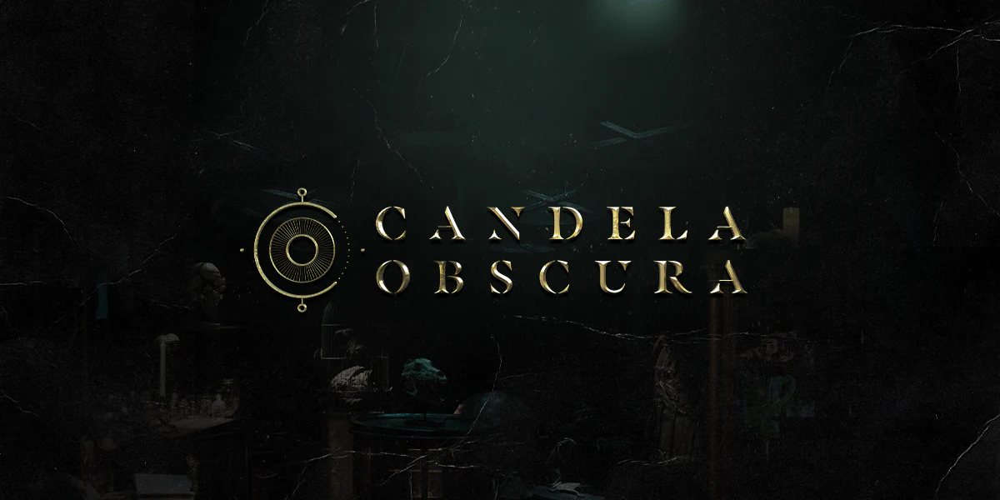

An unofficial digital toolset built for _Candela Obscura_. This new TTRPG, created by [Darrington Press](https://darringtonpress.com/) is the first to use the **Illuminated Worlds System**, a newly designed system that uses 6-sided dice and lends itself to narrative, arc-driven play.

## Additional Links

- [🚧 Follow @NerdyAssWebDev](https://twitter.com/NerdyAssWebDev) – The latest `#BuildInPublic` announcements can be found on Twitter
- [🚀 Download the _Candela Obscura Quickstart Guide_](https://sowl.co/Emy28) – Start playing today with the official pen & paper version of this game
- [📺 Watch Critical Role](https://www.youtube.com/criticalrole) – _Candela Obscura_ is being showcased in a deeply atmospheric monthly actual-play series on their Twitch and YouTube channels
