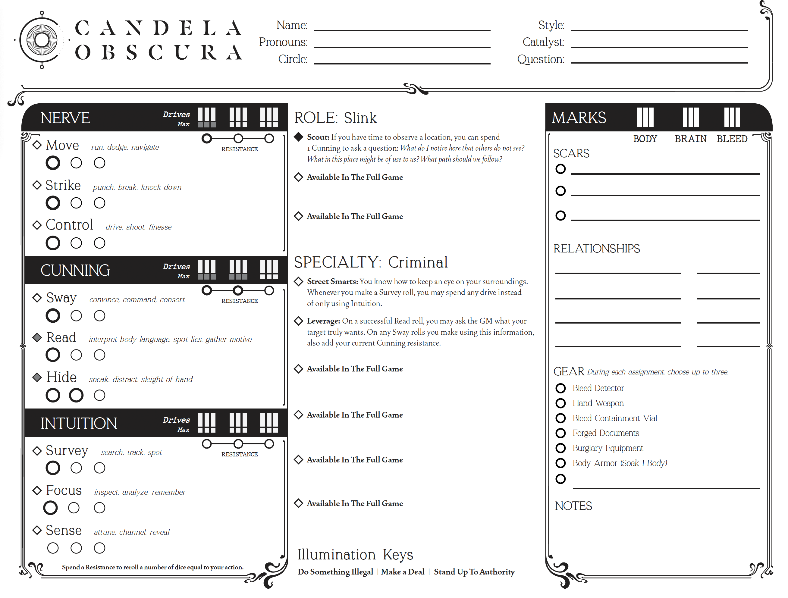

# Character Sheet State

This library contains logic for maintaining all state related to tracking information on a Candela Obscura character sheet.

---

## Building

Run `nx build data-access-character` to build the library.

## Running unit tests

Run `nx test data-access-character` to execute the unit tests via [Jest](https://jestjs.io).
