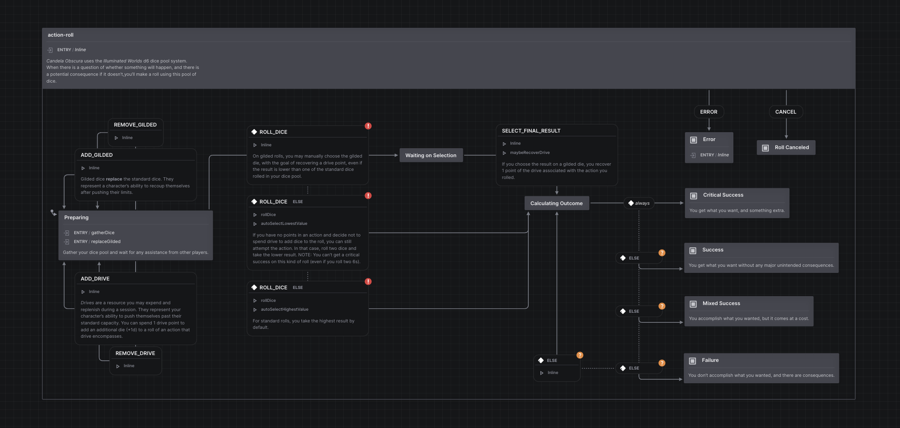

# Action Roll Machine

This machine models the core dice mechanics behind every roll in *Candela Obscura*. 

## TODO

- [ ] Manual roll option?
- [ ] Roll "ownership"
- [ ] Types of rolls
- [ ] Roll assistance
- [ ] Assisted drive refunds if roll is canceled
- [ ] Roll modification via player ability
- [ ] Roll modification via circle ability
- [ ] Refund resources on canceled rolls

## Running unit tests

Run `nx test machines-action-roll` to execute the unit tests via [Vitest](https://vitest.dev).
